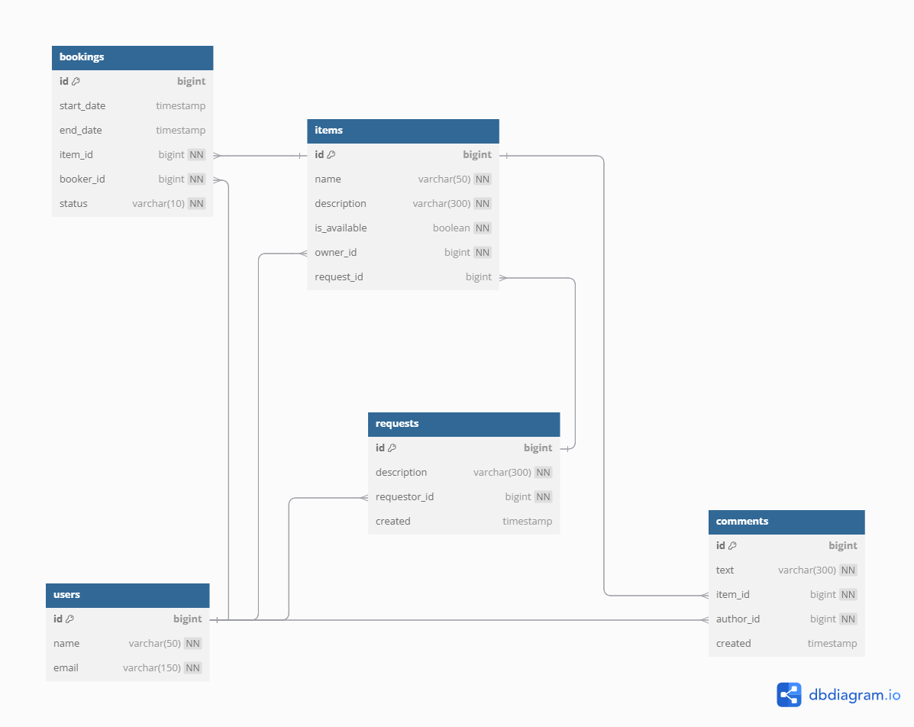

# ShareIt App
### Author: Ilia I (iiv.88@yandex.ru)

### API

### users

---

#### Headers

- No custom request headers
- No custom response headers

#### DTOs
```
UserSaveDto {
    String name;
    String email;
}
```
```
UserDto {
    long id;
    String name;
    String email;
}
```
#### Endpoints

1. **POST users/** _- Add users_
2. **GET user/{userId}** _- Get user by ID_
3. **PATCH user/{userId}** _- Update user_
4. **DELETE users/{userId}** _- Delete user_

### items

---

#### Headers

- Request header (required)
  - **X-Sharer-User-Id** _- user ID_
- No custom response headers

#### DTOs
```
ItemSaveDto {
    String name;
    String description;
    Boolean available;
}
```
```
ItemDto {
    long id;
    String name;
    String description;
    boolean available;
    LocalDateTime nextBooking;
    LocalDateTime lastBooking;
    Collection<CommentDto> comments;
}
```
```
CommentDto {
    long id;
    String text;
    String authorName;
    LocalDateTime created;
}
```
```
CommentSaveDto {
    String text;
}
```
#### Endpoints

1. **POST items/** _- Add item. User (with ID from request header) that adds item becomes item's owner_
2. **GET items/** _- Get all items (this feature is available only for owners)_
3. **GET items/{itemId}** _- Get item by ID (this feature is available only for all users)_
4. **GET /items/search?text={text}** _- Get all items available for share with name and description containing 
the parameter "text"_
5. **PATCH items/{itemId}** _- Update item by ID (this feature is available only for owners)_
6. **POST /items/{itemId}/comment** - _Add comment to previously booked item by ID.
A comment can only be posted by the user who has booked this item and only after the booking period has ended_

### bookings

---

#### Headers

- Request header (required)
  - **X-Sharer-User-Id** _- user ID_
- No custom response headers

#### DTOs
```
BookingSaveDto {
    Long itemId;
    LocalDateTime start;
    LocalDateTime end;
}
```
```
BookingDto {
    long id;
    LocalDateTime start;
    LocalDateTime end;
    BookingStatus status;
    ItemDto item;
    UserDto booker;
}
```
#### Endpoints
```
BookingState {
    WAITING,
    REJECTED,
    CURRENT,
    PAST,
    FUTURE,
    ALL
}
```

1. **POST /bookings** _- Add item booking. Allowed for any user and confirms by items' owner. 
Just after successful post the booking state changes to WAITING (for approval)_
2. **PATCH /bookings/{bookingId}?approved={approved}** _- Approve or reject booking. Allowed only for item's owner,
'approved' parameter could be 'true' or 'false'_
3. **GET /bookings/{bookingId}** _- Get booking by ID. Allowed only for booker or related items' owner_
4. **GET /bookings?state={state}** _- Get all bookings for current user sorted by date from newest to oldest, 
'state' parameter is optional and equals 'ALL' by default. Possible states are the following_: 
```
BookingState {
    WAITING,
    REJECTED,
    CURRENT,
    PAST,
    FUTURE,
    ALL
}
```
5. **GET /bookings/owner?state={state}** _- Get a collection of bookings for all items of the current user 
sorted by date from newest to oldest, 'state' parameter behave the same way as for endpoint 4_

### Entity Relationship Diagram



### Version history
### Version: 1.0
#### Initial implementation
- Added feature layout (models, DTOs, repositories, services, controllers)
- Implemented Item and User endpoints
- RAM repository implementation
### Version: 2.0
- App reworked to use JPA repository 
- Added booking feature
- Added comment feature for booked items
